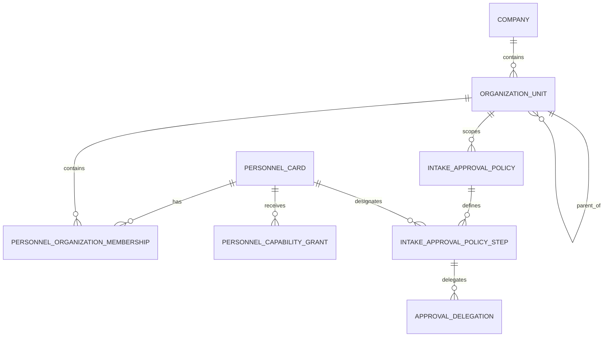
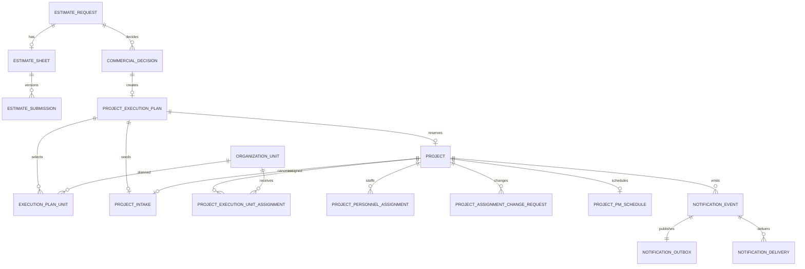

# PI-API-01 PROJECT INTAKE SERVER DESIGN REVIEW v1.1 FINAL

## 0. Design Identity

| Item | Value | Status |
|---|---|---|
| Target repository | `E:/■ 개발_TF팀/Groupware System(Web_finish)/workspace` | TARGET_VERIFIED |
| Branch | `feat/login-board-refresh` | TARGET_VERIFIED |
| Target HEAD | `ec2428093ff732ea41b082821c648095cd10d373` | TARGET_VERIFIED |
| Base design | `PI_API_01_PROJECT_INTAKE_SERVER_DESIGN_REVIEW.md` | TARGET_VERIFIED |
| Policy freeze | `PI_POLICY_ORG_01_FINAL_DECISION.md` | USER_APPROVED |
| Legacy reference | offday2 `4406d2607ace6b64e8a165e4aae8d67e082b992b` | LEGACY_VERIFIED |
| Design status | Final v1.1 design; implementation not authorized | FINAL_DESIGN |
| Code/schema/migration/seed/data/Git changes | 0 | TARGET_VERIFIED |

Evidence labels retain their existing meanings: `TARGET_VERIFIED`, `LEGACY_VERIFIED`, `PROPOSAL`, `INFERENCE`, `UNKNOWN`, and `BLOCKER`. `USER_APPROVED` identifies policy frozen by the user. A final design is not evidence of implementation.

## 1. Baseline and Completed Preconditions

| Precondition | Evidence | State |
|---|---|---|
| F03 CREATE/EDIT selection safety | commit `78b2907` | COMPLETE |
| Project list/detail company scope | commit `448adee` | COMPLETE |
| Won conversion company fallback removal | commit `bae4408` | COMPLETE |
| Project Intake API company header scope | commit `86a75b9` | COMPLETE |
| Non-destructive Prisma deployment command | commit `b1d1ece` | COMPLETE |
| Safe database migration runbook | commit `ec24280` | COMPLETE |
| CON-COST organization policy | `PI_POLICY_ORG_01_FINAL_DECISION.md` | FROZEN |
| Organization persistence/model/seed | Not created | NOT_STARTED |
| PI-API-01A server Draft API | Not created | NOT_STARTED |

Existing unrelated dirty worktree changes are outside this design and remain untouched.

## 2. Final Lifecycle Decision

1. `EstimateRequest -> EstimateSheet -> EstimateSubmission -> CommercialDecision(WON)` remains the commercial lineage.
2. `WON` creates one `ProjectExecutionPlan(DRAFT)` using the explicit selected company.
3. The plan selects one primary organization, one primary team, zero or more participant teams, and zero or more support organizations using canonical OrganizationUnit IDs.
4. Plan confirmation gates Project Intake Draft creation.
5. `POST /api/project-intakes` idempotently creates one hidden reservation Project and one server Draft in one transaction.
6. The four-step Wizard persists to the server with revision checks.
7. Review follows the explicit versioned CON-COST approval policy.
8. Final approval activates the same `projectId`, creates assignments, initializes the PM schedule shell, records audit events, and writes one notification event/outbox row atomically.
9. Organization views query assignments and always return the same canonical Project.
10. offday2 PM schedule, operation, QC, delivery, work-log, and profit-analysis workflows continue by canonical `projectId`.

This retains ADR Option B: hidden Project reservation at server Draft creation and activation at final approval.

## 3. Bounded Contexts

| Context | Owns | Boundary |
|---|---|---|
| Commercial | Estimate requests, sheets, submissions, decisions, agreed terms | Cannot create organization assignments |
| Organization | OrganizationUnit, temporal memberships, explicit capability grants | Does not own Project lifecycle |
| Execution Planning | Primary organization/team, participants, support units, revision and confirmation | No Project copies |
| Project Intake | Four-step server Draft, source snapshot, review/approval state | Does not own organization hierarchy |
| Project Core | One canonical Project, lifecycle, health, visibility, project number | No team-specific mirror Projects |
| Project Assignment | Unit and personnel assignments, validity, change requests | Lifecycle remains in Project Core |
| PM Schedule | PM/resource plan and schedule approval | References canonical Project/Assignment IDs |
| Notification | Immutable event, preferences, endpoints, delivery, outbox | Preferences cannot delete events |
| Files | Attachment metadata, checksum, quarantine, storage reference | No secrets in Draft JSON |
| Audit | Immutable actor/action/entity/correlation records | No mutable business state |

## 4. Approved Organization Contract

### 4.1 Canonical units

The implementation seed is limited to ten user-approved CON-COST units after PI-BLK-03B approval.

| Unit code | Kind | Parent | ProjectAssignable | Intake role |
|---|---|---|---:|---|
| `CON_COST` | COMPANY | - | false | Company boundary |
| `CON_COST.EXECUTIVE` | DEPARTMENT | `CON_COST` | false | Explicit approvers only |
| `CON_COST.MANAGEMENT_SUPPORT` | HEADQUARTERS | `CON_COST` | false | No Project Intake approval role |
| `CON_COST.TECHNICAL_HQ` | HEADQUARTERS | `CON_COST` | false | Primary organization |
| `CON_COST.TECHNICAL_HQ.FINISH` | TEAM | Technical HQ | true | Primary/participant team |
| `CON_COST.TECHNICAL_HQ.STRUCTURE` | TEAM | Technical HQ | true | Primary/participant team |
| `CON_COST.TECHNICAL_HQ.STRUCTURE.BIM_PART` | TEAM | Structure | false | Individual support personnel only |
| `CON_COST.TECHNICAL_HQ.CIVIL_LANDSCAPE` | TEAM | Technical HQ | true | Primary/participant team |
| `CON_COST.CLAIM_CENTER` | ORG_TEAM | `CON_COST` | true | Primary organization and team |
| `CON_COST.DEVELOPMENT` | ORG_TEAM | `CON_COST` | true | Primary organization and team |

### 4.2 Assignment invariants

```text
ownerCompanyId = selectedCompanyId
count(primaryOrganization) = 1
count(primaryTeam) = 1
count(participantTeams) >= 0
count(supportOrganizations) >= 0
all selected units are active and belong to ownerCompanyId
```

- Technical HQ requires a primary team of Finish, Structure, or Civil/Landscape.
- Claim Center and Development may use one `ORG_TEAM` ID for both primary roles.
- Participant teams cannot contain the primary team or duplicates.
- BIM Part cannot be selected as an organization/team/participant; eligible active BIM personnel may be support-person assignments.
- Project names and display labels are never relationship keys.

## 5. Organization and Membership ERD



### Proposed additive entities

| Entity | Essential constraints |
|---|---|
| `OrganizationUnit` | UUID, companyId, unique `(companyId, unitCode)`, parent, kind, active, projectAssignable |
| `PersonnelOrganizationMembership` | personnelCardId, unitId, type, role, validFrom/validTo; one active PRIMARY per person/company |
| `PersonnelCapabilityGrant` | explicit `canBeProjectPm` or scoped capability; validity and audit |
| `IntakeApprovalPolicy` | company, organization scope, version, active validity |
| `IntakeApprovalPolicyStep` | ordered REVIEW/APPROVE/FINAL, explicit personnelCardId |
| `ApprovalDelegation` | step/person/delegate, valid period, reason, designator, revoked state |

No entity above exists until a separately approved PI-BLK-03B schema phase.

## 6. Frozen Approval Policy

| Scope | Review | Approval | Final |
|---|---|---|---|
| Technical HQ | `demo-cc-technical-001` | `demo-cc-executive-002` | `demo-cc-admin-001` |
| Claim Center | `demo-cc-claim-001` | `demo-cc-executive-002` | `demo-cc-admin-001` |
| Development | `demo-cc-development-001` | `demo-cc-executive-002` | `demo-cc-admin-001` |

Rules:

- `demo-cc-technical-002` has no standing review authority and may only receive a time-bounded Technical HQ delegation.
- Missing, inactive, wrong-company, or ineligible step actors return `APPROVAL_POLICY_UNRESOLVED` and block progress.
- No current-user fallback and no skipped steps.
- Author and final approver must differ.
- Management Support candidates are excluded from this approval line.
- Titles and ranks do not resolve policy actors.

## 7. Personnel and Eligibility

Server PM and assignment eligibility requires:

1. active PersonnelCard;
2. active employment under the current approved source;
3. personnel company equals Project company;
4. valid membership;
5. explicit capability such as `canBeProjectPm`;
6. scope covers the selected Project/unit;
7. account is not one of the two demo IDs.

Historical references to terminated or suspended personnel remain, but new assignments are rejected.

Excel `NO.` is import metadata, not an identity key. The temporary workbook source must record file hash, effective date, approval actor, and version. ERP HR DB replaces it as employment SSOT.

## 8. Core ERD



## 9. State Machines

### Execution plan

| From | Action | To | Guard |
|---|---|---|---|
| none | create after WON | DRAFT | explicit company and one decision |
| DRAFT | save units | DRAFT | revision and organization contract |
| DRAFT | confirm | CONFIRMED | exact primary organization/team |
| CONFIRMED | create Intake | CONSUMED | one Project and one Intake |
| DRAFT | cancel | CANCELLED | no Intake |

### Intake

| From | Action | To | Guard |
|---|---|---|---|
| none | server create | DRAFT | confirmed plan and idempotency |
| DRAFT/CHANGES_REQUESTED | save step | same | revision and step schema |
| DRAFT/CHANGES_REQUESTED | submit | SUBMITTED | all four steps complete |
| SUBMITTED | start review | UNDER_REVIEW | resolved review actor |
| UNDER_REVIEW | request changes | CHANGES_REQUESTED | reason required |
| CHANGES_REQUESTED | resubmit | SUBMITTED | completeness |
| UNDER_REVIEW | approve step | UNDER_REVIEW | next explicit actor exists |
| UNDER_REVIEW | final approve | APPROVED | author differs; all prior steps complete |
| DRAFT/CHANGES_REQUESTED | cancel | CANCELLED | creator/manager and no final approval |

### Project lifecycle and assignment

Project lifecycle and Assignment state remain separate.

| Project lifecycle | Meaning |
|---|---|
| `INTAKE_PREPARATION` | Hidden reservation |
| `START_PLANNED` | Approved and visible to assigned units |
| `PM_ASSIGNMENT` | PM/resource assignment |
| `SCHEDULE_PLANNING` | Schedule proposal |
| `ACTIVE` | Operational work |
| `QC` | Quality control |
| `DELIVERY` | Delivery |
| `CLOSED` | Completed/archive |

Assignment statuses include `START_PLANNED`, `ACTIVE`, `CHANGE_PENDING`, and `CLOSED`. Team changes use request, approval, reason, effective dates, history, and re-notification.

## 10. ID Lineage and Data Inheritance

```text
EstimateRequest.id
 -> EstimateSheet.estimateRequestId
 -> EstimateSubmission.estimateSheetId
 -> CommercialDecision.estimateRequestId/submissionId
 -> ProjectExecutionPlan.commercialDecisionId
 -> Project.id (hidden reservation)
 -> ProjectIntake.projectId/executionPlanId
 -> Assignment.projectId/sourcePlanUnitId
 -> PmSchedule/QC/Delivery/WorkLog/Profit.projectId
```

The Intake Draft inherits immutable source IDs and a safe source snapshot:

| Source | Intake/Project target |
|---|---|
| Estimate request and submission IDs | immutable lineage fields |
| Won decision and agreed terms | source snapshot plus decision reference |
| Selected company | ownerCompanyId |
| Confirmed primary organization/team | execution plan references |
| Participant/support units | plan-unit rows |
| Project basic information | four-step Draft |
| Request attachments | validated attachment references, not raw secrets |

Names are display-only. Idempotency and lineage use IDs and unique constraints.

## 11. API Contract

### Common contract

- `Authorization`: authenticated session/token.
- `X-Company-Id`: required; missing 400, unauthorized 403.
- `Idempotency-Key`: required on create/confirm/approve commands.
- `If-Match` or revision field: required on mutable aggregates.
- Server validates allowed companies, entity company, organization company, role, scope, state, revision, and policy.

### Endpoints

| Method | Endpoint | Purpose |
|---|---|---|
| POST | `/api/project-execution-plans` | Create/return DRAFT after WON |
| GET | `/api/project-execution-plans/:id` | Read scoped plan |
| PATCH | `/api/project-execution-plans/:id` | Save unit selections |
| POST | `/api/project-execution-plans/:id/confirm` | Freeze valid plan |
| POST | `/api/project-intakes` | Create reservation Project and Draft |
| GET | `/api/project-intakes/:id` | Read scoped Draft |
| PATCH | `/api/project-intakes/:id/steps/:step` | Save one Wizard step |
| POST | `/api/project-intakes/:id/submit` | Submit |
| POST | `/api/project-intakes/:id/review` | Start review |
| POST | `/api/project-intakes/:id/request-changes` | Return with reason |
| POST | `/api/project-intakes/:id/approve` | Execute one policy step/final activation |
| POST | `/api/project-intakes/:id/cancel` | Cancel eligible Draft |
| GET | `/api/projects` | Company/assignment-scoped list |
| GET | `/api/projects/:id` | Company/assignment-scoped detail |
| POST | `/api/projects/:id/assignment-change-requests` | Request team change |

### Draft CREATE request

```json
{
  "executionPlanId": "uuid",
  "sourceDecisionId": "uuid",
  "initialStep": 1,
  "revision": 0
}
```

Company, project number, actor IDs, approval state, and assignment rows are server-owned and cannot be mass-assigned.

### Required errors

| Code | HTTP |
|---|---:|
| `COMPANY_REQUIRED` | 400 |
| `COMPANY_FORBIDDEN` | 403 |
| `COMPANY_MISMATCH` | 409 |
| `ORGANIZATION_POLICY_UNRESOLVED` | 409 |
| `ORGANIZATION_UNIT_NOT_ASSIGNABLE` | 422 |
| `PRIMARY_ORGANIZATION_REQUIRED` | 422 |
| `PRIMARY_TEAM_REQUIRED` | 422 |
| `APPROVAL_POLICY_UNRESOLVED` | 409 |
| `APPROVER_INACTIVE` | 409 |
| `AUTHOR_FINAL_APPROVER_CONFLICT` | 422 |
| `PERSONNEL_NOT_ELIGIBLE` | 422 |
| `DEMO_ACCOUNT_FORBIDDEN` | 403 |
| `VIET_QS_ORG_DISABLED` | 409 |
| `CROSS_COMPANY_ASSIGNMENT_UNSUPPORTED` | 409 |
| `REVISION_CONFLICT` | 409 |
| `IDEMPOTENCY_KEY_REUSED_WITH_DIFFERENT_REQUEST` | 409 |

## 12. Revision, Concurrency, and Idempotency

- ExecutionPlan, ProjectIntake, Project, and change requests use integer revisions.
- Updates use compare-and-swap semantics.
- The losing concurrent writer receives 409 with current revision metadata.
- Create/confirm/approve keys are unique by `(companyId, scope, idempotencyKey)`.
- Store request hash and result reference; the same key with a different hash is rejected.
- Unique constraints cover decision-to-plan, plan-to-intake, plan-to-project, source plan unit-to-assignment, event dedupe, and event/user/channel delivery.

## 13. Final Approval Transaction

```text
BEGIN
  validate session, X-Company-Id, allowedCompanyIds
  load Intake + Plan + reserved Project FOR UPDATE
  assert all company IDs equal selected company
  assert revision and idempotency request hash
  load active versioned approval policy
  resolve exact current step personnelCardId
  reject missing/inactive/wrong-company actor
  reject author == final approver on final step
  record step decision and audit

  if not final step:
    keep UNDER_REVIEW
    require next actor to resolve
    finalize idempotency result
    COMMIT

  validate four-step completeness and READY attachments
  update Intake to APPROVED
  update reserved Project to START_PLANNED / ASSIGNED_UNITS
  insert assignments from confirmed plan using unique sourcePlanUnitId
  insert eligible BIM/personnel support assignments separately
  upsert one PM schedule shell by projectId
  insert histories and company-scoped audit records
  insert immutable PROJECT_ACTIVATED event with unique dedupe key
  insert one outbox row
  finalize idempotency result
COMMIT
```

Email, browser/mobile push, object storage, QC, delivery, and profit initialization do not execute inside this transaction. Optional consumers run idempotently after commit.

## 14. Notification Design

- Notification Event is immutable and retained regardless of preferences.
- Preferences control delivery only.
- Supported channels: APP, EMAIL, BROWSER, MOBILE.
- Scope options: OWN, PRIMARY_TEAM, PARTICIPATING_TEAMS, PRIMARY_ORG, MANAGED_UNITS.
- Event and recipient resolution are company-scoped.
- Demo accounts are always excluded in production.
- `PROJECT_ACTIVATED` recipients default to designated managers and explicitly assigned PM/personnel; broad ordinary-member delivery requires a later policy.
- Outbox lease/retry/dead-letter behavior and delivery uniqueness prevent duplicates.
- Payloads contain safe IDs/summaries only, never secrets or public attachment URLs.

## 15. Organization-Scoped Project Queries

```text
Project.companyId == X-Company-Id
AND Project.visibility == ASSIGNED_UNITS
AND actor has company permission
AND an active Assignment matches the requested/visible OrganizationUnit scope
```

- Technical HQ view expands to approved descendant team assignments.
- Finish, Structure, and Civil/Landscape use exact team assignments.
- Claim Center and Development use exact `ORG_TEAM` assignments.
- A Project may appear in multiple authorized views, always with the same `projectId`.
- No administrator may omit selected company to obtain an all-company query.

## 16. Security and Audit

### Attachments

- Draft stores metadata/reference only.
- Server generates company/intake/attachment storage paths.
- Validate extension, sniffed MIME, size, checksum, malware status, quarantine, and uploader.
- Downloads perform fresh permission checks and issue short-lived references.
- Webhard passwords, OAuth/provider tokens, and credentials are never stored in Draft JSON, browser storage, notification payloads, or audit details.

### Audit events

At minimum record commercial decision, plan create/update/confirm, Project reservation, Draft create/save/submit/review/change request/approval/cancel, Project activation, Assignment create/change, approval delegation, event creation, and delivery failure.

Each record includes companyId, actor personnel/account ID, action, entity type/ID, correlation ID, request ID, safe before/after data, and timestamp.

## 17. Feature Flags

| Flag | Default | Gate |
|---|---|---|
| `ORGANIZATION_ASSIGNMENT_V1` | OFF | Approved schema/seed and data audit |
| `PROJECT_INTAKE_APPROVAL_POLICY_V1` | OFF | Versioned policy rows and actor validation |
| `PI_EXECUTION_PLAN_V1` | OFF | Plan API and company tests |
| `PI_SERVER_INTAKE_CREATE_V1` | OFF | Draft CREATE/idempotency tests |
| `PI_ASSIGNMENT_PROJECTION_V1` | OFF | Backfill and scoped query tests |
| `PI_NOTIFICATION_OUTBOX_V1` | OFF | Event/outbox/delivery tests |
| `PI_ASSIGNMENT_CHANGE_V1` | OFF | Change workflow tests |
| `VIET_QS_ORGANIZATION_V1` | OFF | Separate local approval |
| `VIET_QS_PROJECT_INTAKE_APPROVAL_V1` | OFF | Separate approval policy |
| `CROSS_COMPANY_PROJECT_V1` | OFF | Deferred PI-XCO-01 |

Flags are server-owned, company-aware, auditable, and never grant permission.

## 18. Additive Migration, Backfill, and Rollback Plan

Implementation remains blocked until PI-ENV-01 and PI-BLK-03B approval.

1. Prepare an isolated PostgreSQL validation environment.
2. Add OrganizationUnit, memberships, capabilities, approval policies, and delegation models.
3. Seed only the ten approved CON-COST units and explicit personnel mappings.
4. Exclude demo accounts from production operational seed.
5. Add plan, plan-unit, lifecycle, assignment, change-request, notification, outbox, and idempotency models additively.
6. Keep legacy fields during transition; do not drop columns.
7. Record workforce workbook hash/effective date and quarantine ambiguous rows.
8. Never infer units from Project names or display labels.
9. Re-run PI-DATA-01 against the isolated real database before enabling flags.
10. Use reviewed `prisma migrate deploy`; never use destructive `db push --accept-data-loss`.

Rollback disables flags and workers, preserves events/history, closes assignments compensatingly, and never deletes canonical Projects. Additive tables are not dropped after data exists.

## 19. Test Plan

### Unit

- Ten-unit policy and five ProjectAssignable units.
- Exact one primary organization/team.
- Technical HQ child-team requirement.
- ORG_TEAM dual-role behavior.
- BIM unit rejection and eligible-person support assignment.
- membership, employment, capability, demo exclusion.
- explicit approval actor/delegation and author-final conflict.
- revisions, state transitions, idempotency, recipient preferences.

### Integration

- Missing company 400; unauthorized company 403; mismatch 409.
- CON-COST list/detail/filter/pagination isolation.
- WON creates one plan under explicit company.
- Repeated Draft CREATE creates one Project and Intake.
- Review steps resolve only frozen personnel IDs.
- Missing/inactive approver blocks progression without fallback.
- Final transaction creates assignments and one event/outbox or rolls back all.
- Same `projectId` appears in every authorized organization view.
- Viet QS organization/approval commands remain disabled.
- Cross-company assignments are rejected.
- Demo accounts receive no authority or production delivery.

### E2E and security

- Commercial lineage through four-step Draft, changes, final approval, Project visibility, PM schedule handoff.
- Refresh/retry/double-click/concurrent editing.
- IDOR across company, unit, Intake, Project, attachment, notification.
- forged company header, role escalation, mass assignment, malicious file, secret scan.
- APP preference behavior while immutable event remains.

## 20. Implementation File Plan

No listed file is authorized for modification by this design freeze.

| Phase | Files/area | Purpose |
|---|---|---|
| PI-ENV-01 | External environment plan | Isolated PostgreSQL validation environment |
| PI-BLK-03B | `server/prisma/schema.prisma`, migration proposal, seed proposal | Organization/membership/policy model design |
| PI-DATA-01 | Read-only audit tools/reports | Validate real company, lineage, membership data |
| PI-API-01A | Project Intake domain/controller/routes/tests | Server Draft CREATE and four-step persistence |
| Later | Execution plan, assignment, notification domains | Approved staged implementation |

Implementation commits must remain single-purpose. Folder movement, unrelated UI changes, or current dirty-worktree cleanup are forbidden.

## 21. Remaining Decisions and Blockers

| Item | State |
|---|---|
| Viet QS P&O2 primary leader | USER_REQUIRED |
| Viet QS Horizon1 primary/deputy | USER_REQUIRED |
| Viet QS Horizon3 primary leader | USER_REQUIRED |
| Viet QS Civil manager | USER_REQUIRED |
| Vice-president/representative/Claim/Development delegates | UNASSIGNED; approval fails closed |
| Production HR employment SSOT | Transition plan approved; HR DB implementation pending |
| Notification providers and broad member defaults | Later channel-enablement decision |
| Cross-company participation | Deferred to PI-XCO-01 |
| Organization DB model and seed | BLOCKED until PI-BLK-03B approval |
| Server Project Intake CREATE | BLOCKED until PI-API-01A approval |

## 22. Final Quality Gate

| Requirement | Result |
|---|---|
| Approved CON-COST units = 10 | PASS |
| ProjectAssignable units = 5 | PASS |
| Primary organization candidates = 3 | PASS |
| Explicit personnel mapping has no duplicate/missing ID | PASS |
| Author cannot equal final approver | PASS |
| Demo-account authority candidates = 0 | PASS |
| Viet QS operational authority grants = 0 | PASS |
| Automatic permission grants = 0 | PASS |
| Cross-company participation excluded | PASS |
| Code/schema/migration/seed/data/Git mutation = 0 | PASS |

## 23. Final Verdict

**PI-API-01 v1.1 DESIGN FINAL: `POLICY_FROZEN_CON_COST_V1`**

The next step is not implementation. The next permitted activity is a separately approved `PI-ENV-01` isolated PostgreSQL validation-environment plan.
