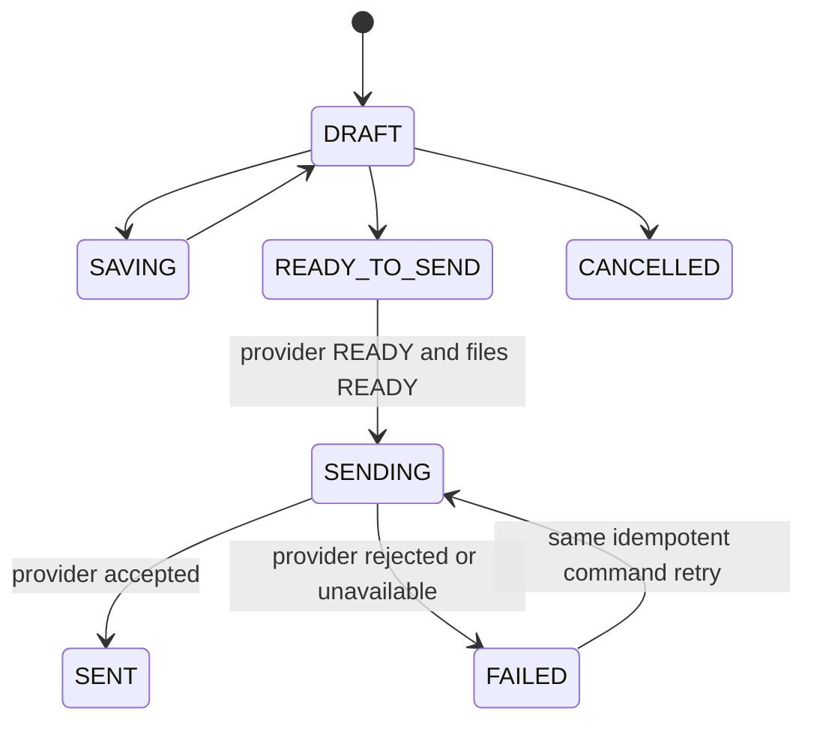
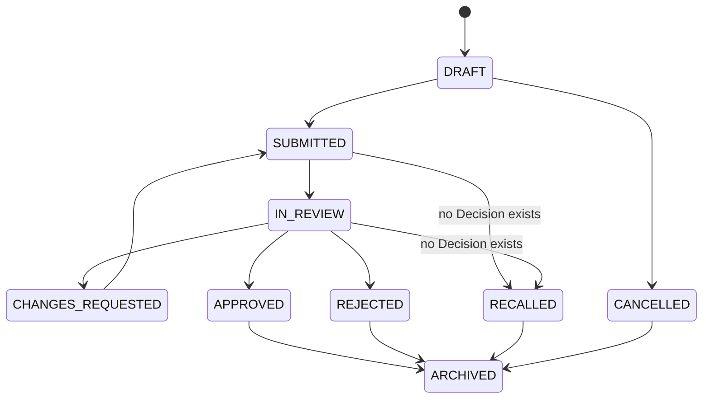

# Collaboration State Machines v1.0

Status: **COLLABORATION_CONTRACT_FROZEN_V1**

The backend is authoritative in API_SANDBOX and PRODUCTION_SERVER. A local simulation is never provider or server success.

## Mail Draft

Provider delivery is separate: `QUEUED -> ACCEPTED_BY_PROVIDER -> DELIVERED|BOUNCED|REJECTED|UNKNOWN`. Provider acceptance is not final delivery.

## Approval Document

Final states APPROVED, REJECTED, RECALLED, CANCELLED and ARCHIVED are immutable records. After the first Decision, recall is an approved request; after APPROVED, correction/replacement uses a new document.

Approval Step states are `PENDING|IN_PROGRESS|APPROVED|REJECTED|CHANGES_REQUESTED|DELEGATED|SKIPPED_BY_POLICY|CANCELLED`. v1 execution modes are `SEQUENTIAL|PARALLEL_ALL|REFERENCE_ONLY`; `PARALLEL_ANY` is capability-disabled.

## Calendar

- Event: `TENTATIVE|CONFIRMED -> CANCELLED`.
- Personal default visibility: `BUSY_ONLY`.
- Recurrence edit default: `THIS_OCCURRENCE`; alternatives are `THIS_AND_FUTURE|ENTIRE_SERIES`.
- Attendee: `NEEDS_ACTION -> ACCEPTED|DECLINED|TENTATIVE`.

## Task

`TODO -> IN_PROGRESS -> DONE`, with `IN_PROGRESS <-> BLOCKED` and `TODO|IN_PROGRESS -> CANCELLED`. APP reminders default to -24h, Due and +24h. Event history remains even when a delivery channel is disabled.

## Board Post

`DRAFT -> IN_REVIEW -> APPROVED -> PUBLISHED -> ARCHIVED`. Direct-publish capability may use `DRAFT -> PUBLISHED`; scheduled publication uses `APPROVED -> SCHEDULED -> PUBLISHED`. Withdrawal uses `DRAFT|IN_REVIEW|APPROVED|SCHEDULED -> WITHDRAWN`.

Only approved important notices may require explicit acknowledgement. Displaying a post is not acknowledgement.

## Notification Delivery

`PENDING -> SENT|FAILED|SKIPPED|CANCELLED`. Read state and preference are separate from immutable Event history.

## Search

Provider groups are `READY|PARTIAL|FAILED`. Partial failure preserves authorized successful groups and exposes no unauthorized metadata.
