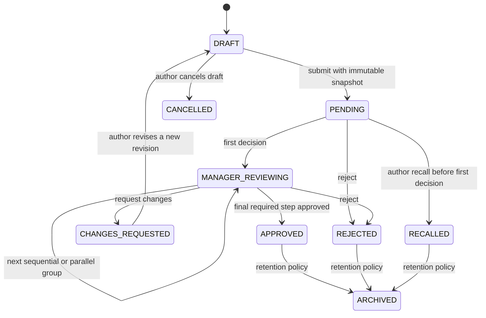

# ZioYou Document State Machine

Rules:

1. Submission stores a line version and deep-copied steps. Later saved-line edits do not mutate the document.
2. The author cannot be the final approver.
3. Missing policy candidates block submission; the current user is never used as a fallback.
4. Parallel steps complete only when the Backend confirms every required member.
5. Distribution delivery and approval decisions are different contexts.
6. Production transitions require server revision, idempotency, company scope, permission, and audit responses.
